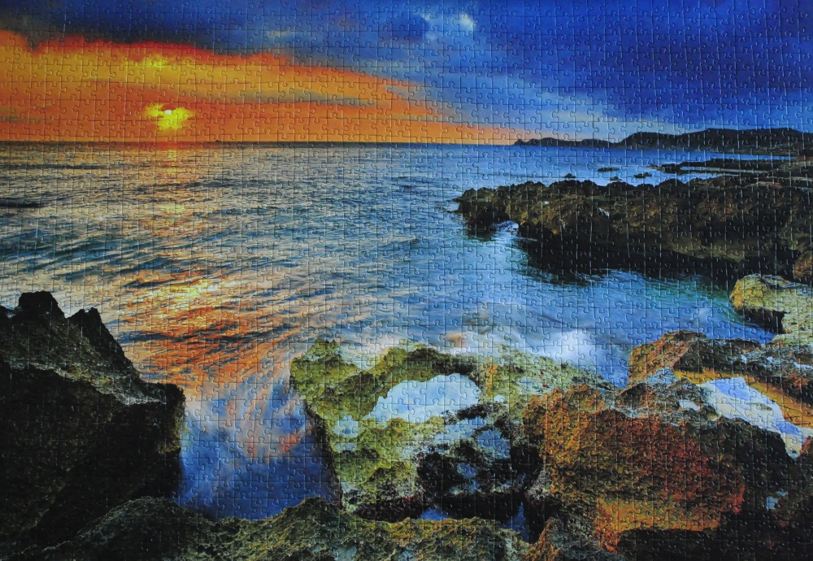
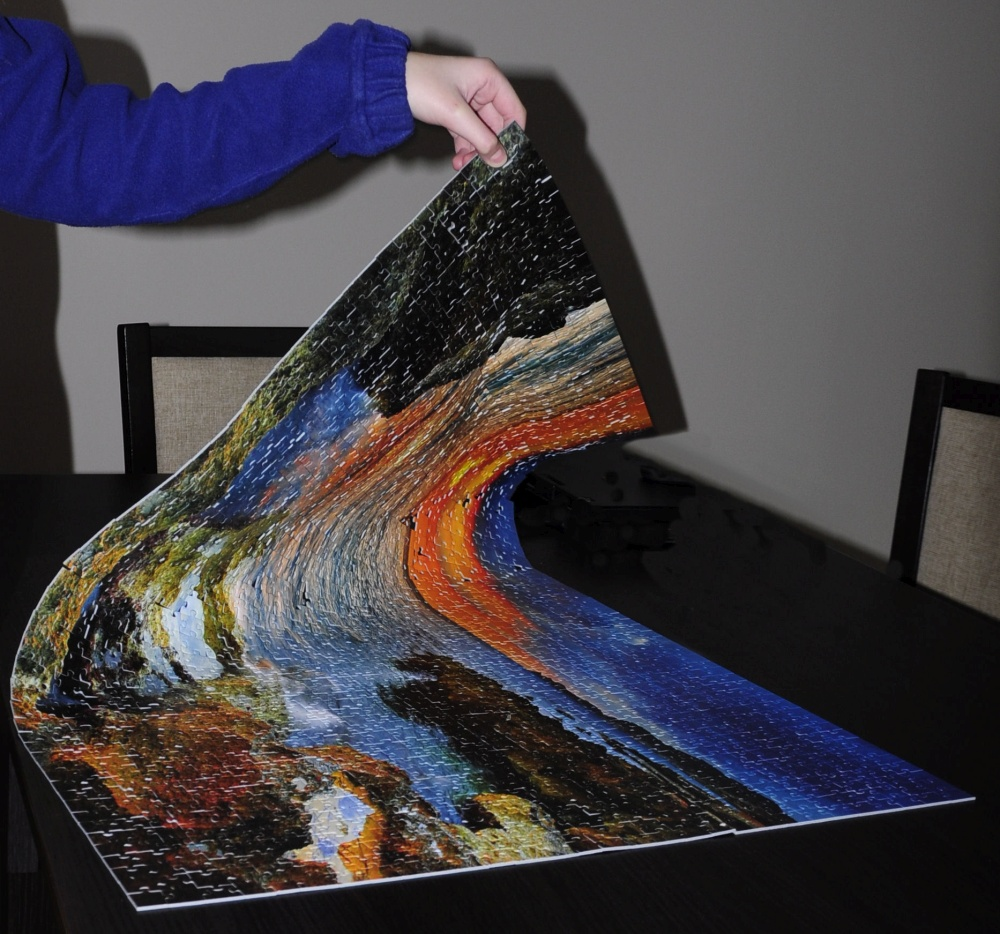
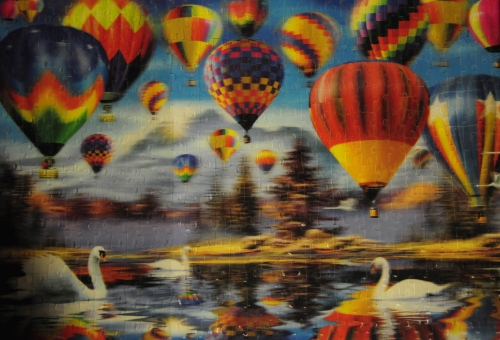

## puzzle

[moje notatki w wykadu - cakiem jak puzzle...](https://github.com/aniawr/notatki-z-wykladow)

bo wszystko (zwaszcza informatyka!) jest bardzo zlozone i czasochonne, ale do ulozenia 
:sweat:

#moje puzzelki

przepiekny zachod slonca u wybrzezy Hiszpanii, niestety na puzzlach nie sa podawane dokladniejsze dane gdzie fotografia zostala wykonana :eyes:

jak juz puzzelki sa ulozone, zdjecie zrobione, to czas je... podniesc :four_leaf_clover:

puzzle z trojwymiarowym efektem - bardzo meczace dla oczu podczas ukladania

największe puuzle świata -  551 232 kawałki. Wymiar calego obrazka 14,85m x 23,20m.

# tabelka

| ilosc elementow |czas           |
| --------------: |--------------:|
|1500             |2 dni          |
|1000             |prawie 2 dni   |
|500              |4 h            |
|24               |5 min.         |

# linki

to nie to samo co "na zywo", ale tez mozna :relaxed:

1. [www.ipuzzle.pl](http://www.ipuzzle.pl/)
1. [www.puzzleonline.eu](http://www.puzzleonline.eu/)

